# Benchmark app
<!-- TOC -->
* [Benchmark app](#benchmark-app)
    * [Stack](#stack)
    * [Hardware](#hardware)
    * [Benchmark Tools](#benchmark-tools)
    * [Report](#report)
<!-- TOC -->

### Stack
* Spring boot kotlin (Coroutines)
* Spring boot reactive
* Spring boot tomcat (Virtual Thread preview)

### Hardware
* Intel(R) Core(TM) i5-10210U CPU @ 1.60GHz   2.11 GHz
* 16.0 GB (15.8 GB usable)

### Benchmark Tools
* [Vegeta](https://github.com/tsenart/vegeta) (-cpus=2 -duration=30s)

### Report
* **spring boot kotlin (Coroutines)**
```text
./Attack -cpus=2 -duration=30s -rate=3000

Requests      [total, rate, throughput]         90000, 2999.82, 2902.71
Duration      [total, attack, wait]             31.006s, 30.002s, 1.004s
Latencies     [min, mean, 50, 90, 95, 99, max]  1s, 1.024s, 1.013s, 1.04s, 1.088s, 1.217s, 1.571s
Bytes In      [total, mean]                     1800000, 20.00
Bytes Out     [total, mean]                     0, 0.00
Success       [ratio]                           100.00%
Status Codes  [code:count]                      200:90000  
```
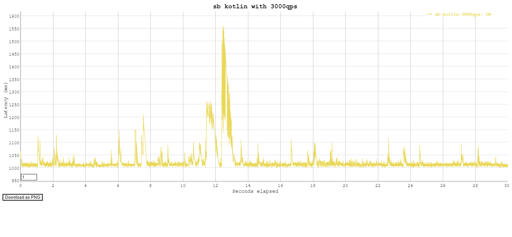
```text
./Attack -cpus=2 -duration=30s -rate=3500

Requests      [total, rate, throughput]         97193, 3209.33, 3045.76
Duration      [total, attack, wait]             31.909s, 30.284s, 1.624s
Latencies     [min, mean, 50, 90, 95, 99, max]  14.716ms, 1.299s, 1.022s, 2.505s, 2.893s, 3.696s, 3.95s
Bytes In      [total, mean]                     1943740, 20.00
Bytes Out     [total, mean]                     0, 0.00
Success       [ratio]                           99.99%
Status Codes  [code:count]                      0:6  200:97187
```
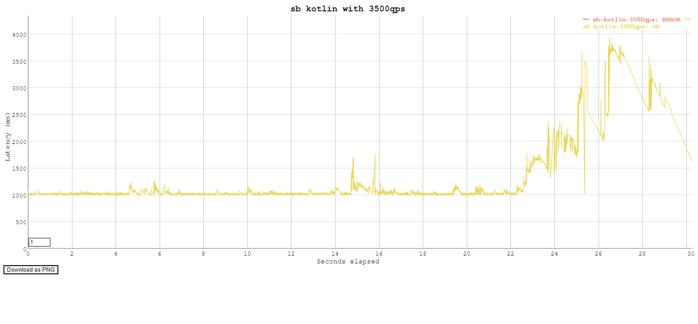
```text
./Attack -cpus=2 -duration=30s -rate=4000

Requests      [total, rate, throughput]         57974, 1782.61, 1178.48
Duration      [total, attack, wait]             49.111s, 32.522s, 16.589s
Latencies     [min, mean, 50, 90, 95, 99, max]  997.37ms, 3.824s, 2.715s, 7.658s, 8.463s, 11.389s, 30.041s
Bytes In      [total, mean]                     1157520, 19.97
Bytes Out     [total, mean]                     0, 0.00
Success       [ratio]                           99.83%
Status Codes  [code:count]                      0:98  200:57876
```
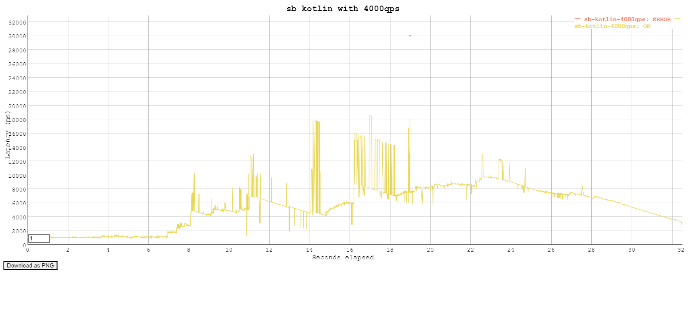
```text
./Attack -cpus=2 -duration=30s -rate=4500

Requests      [total, rate, throughput]         66696, 2224.76, 1161.11
Duration      [total, attack, wait]             57.36s, 29.979s, 27.381s
Latencies     [min, mean, 50, 90, 95, 99, max]  988.602ms, 3.46s, 1.463s, 8.857s, 9.775s, 11.202s, 30.017s
Bytes In      [total, mean]                     1332020, 19.97
Bytes Out     [total, mean]                     0, 0.00
Success       [ratio]                           99.86%
Status Codes  [code:count]                      0:95  200:66601
```
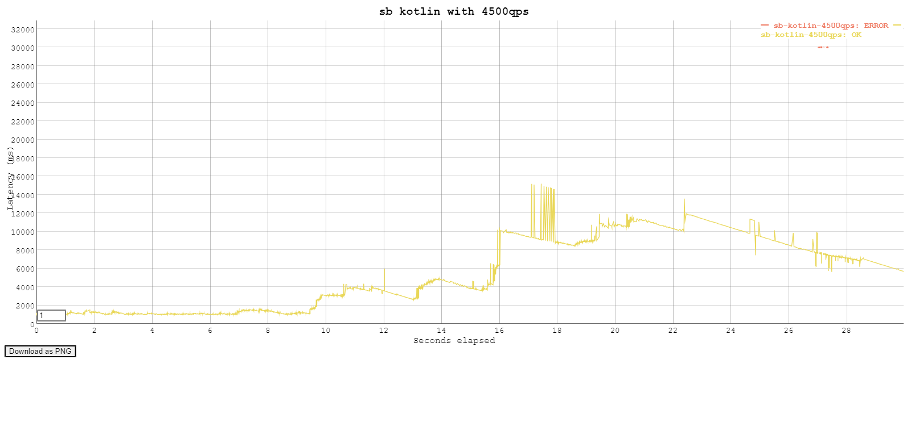
```text
./Attack -cpus=2 -duration=30s -rate=5500

Requests      [total, rate, throughput]         41968, 1254.54, 1117.78
Duration      [total, attack, wait]             35.049s, 33.453s, 1.596s
Latencies     [min, mean, 50, 90, 95, 99, max]  39.928ms, 5.526s, 1.903s, 19.862s, 21.563s, 22.528s, 24.342s
Bytes In      [total, mean]                     783540, 18.67
Bytes Out     [total, mean]                     0, 0.00
Success       [ratio]                           93.35%
Status Codes  [code:count]                      0:2791  200:39177
```
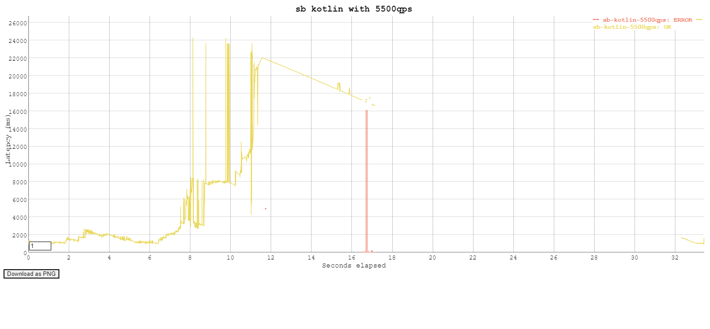

* **spring boot reactive**
```text
./Attack -cpus=2 -duration=30s -rate=3000

Requests      [total, rate, throughput]         89978, 2999.28, 2902.20
Duration      [total, attack, wait]             31.003s, 30s, 1.003s
Latencies     [min, mean, 50, 90, 95, 99, max]  998.053ms, 1.032s, 1.013s, 1.03s, 1.092s, 1.499s, 1.718s
Bytes In      [total, mean]                     1979516, 22.00
Bytes Out     [total, mean]                     0, 0.00
Success       [ratio]                           100.00%
Status Codes  [code:count]                      200:89978  
```
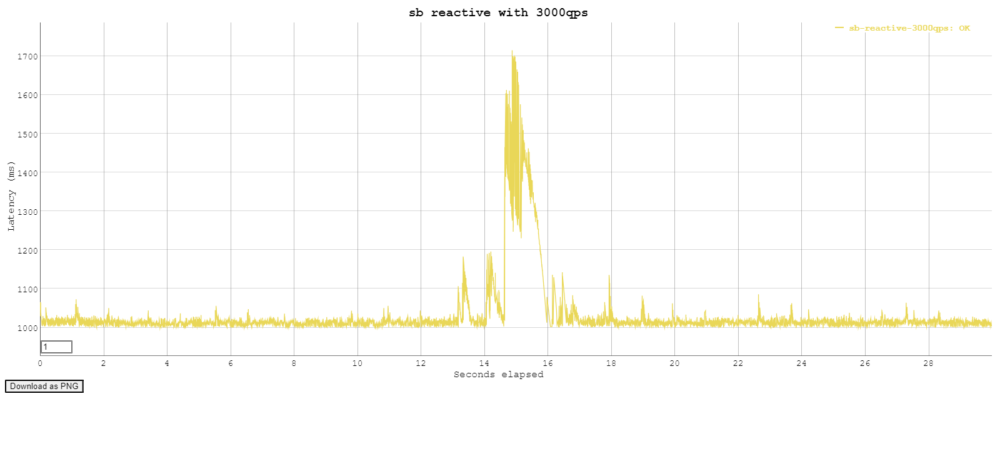
```text
./Attack -cpus=2 -duration=30s -rate=3500

Requests      [total, rate, throughput]         83926, 2728.87, 2437.67
Duration      [total, attack, wait]             34.429s, 30.755s, 3.674s
Latencies     [min, mean, 50, 90, 95, 99, max]  995.29ms, 1.791s, 1.021s, 4.332s, 6.431s, 7.798s, 10.406s
Bytes In      [total, mean]                     1846372, 22.00
Bytes Out     [total, mean]                     0, 0.00
Success       [ratio]                           100.00%
Status Codes  [code:count]                      200:83926
```
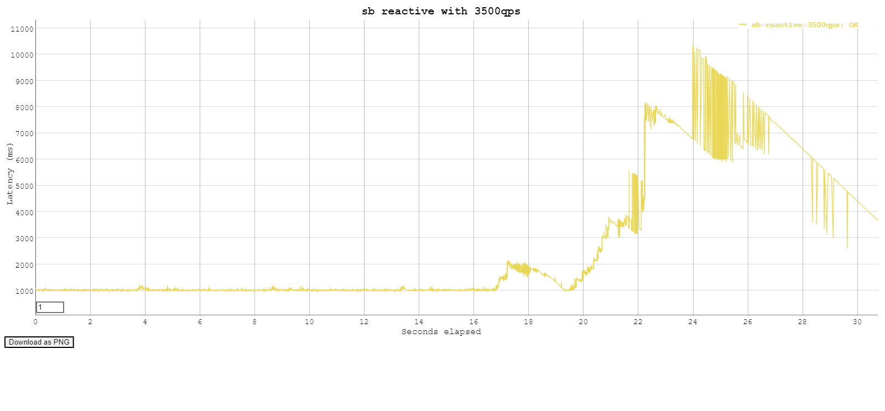
```text
./Attack -cpus=2 -duration=30s -rate=3500

Requests      [total, rate, throughput]         83926, 2728.87, 2437.67
Duration      [total, attack, wait]             34.429s, 30.755s, 3.674s
Latencies     [min, mean, 50, 90, 95, 99, max]  995.29ms, 1.791s, 1.021s, 4.332s, 6.431s, 7.798s, 10.406s
Bytes In      [total, mean]                     1846372, 22.00
Bytes Out     [total, mean]                     0, 0.00
Success       [ratio]                           100.00%
Status Codes  [code:count]                      200:83926
```

```text
./Attack -cpus=2 -duration=30s -rate=4000

Requests      [total, rate, throughput]         29336, 944.63, 900.56
Duration      [total, attack, wait]             32.575s, 31.055s, 1.52s
Latencies     [min, mean, 50, 90, 95, 99, max]  1s, 6.769s, 2.872s, 16.681s, 20.894s, 23.131s, 25.41s
Bytes In      [total, mean]                     645392, 22.00
Bytes Out     [total, mean]                     0, 0.00
Success       [ratio]                           100.00%
Status Codes  [code:count]                      200:29336
```
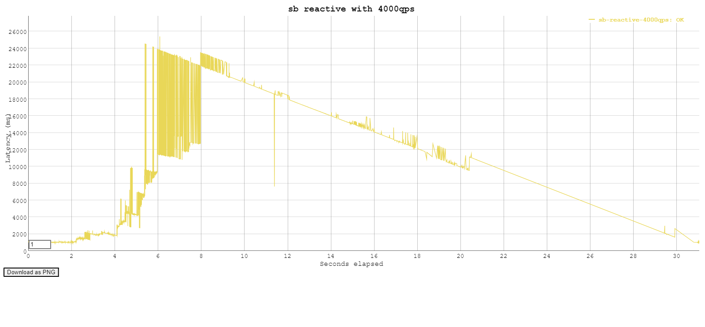

* **spring boot tomcat (Virtual Thread preview)**
```text
./Attack -cpus=2 -duration=30s -rate=3000

Requests      [total, rate, throughput]         89982, 2999.74, 2901.89
Duration      [total, attack, wait]             31.008s, 29.997s, 1.011s
Latencies     [min, mean, 50, 90, 95, 99, max]  997.485ms, 1.061s, 1.015s, 1.25s, 1.326s, 1.409s, 1.665s
Bytes In      [total, mean]                     1799640, 20.00
Bytes Out     [total, mean]                     0, 0.00
Success       [ratio]                           100.00%
Status Codes  [code:count]                      200:89982
```
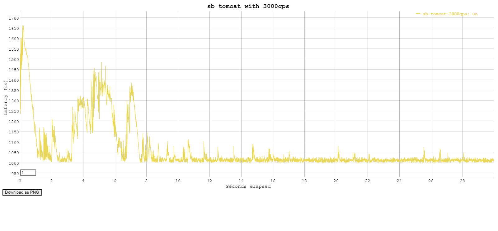
```text
./Attack -cpus=2 -duration=30s -rate=3500

Requests      [total, rate, throughput]         78330, 2610.07, 2279.03
Duration      [total, attack, wait]             34.331s, 30.011s, 4.32s
Latencies     [min, mean, 50, 90, 95, 99, max]  998.188ms, 1.862s, 1.018s, 5.026s, 5.945s, 7.827s, 11.265s
Bytes In      [total, mean]                     1564820, 19.98
Bytes Out     [total, mean]                     0, 0.00
Success       [ratio]                           99.89%
Status Codes  [code:count]                      0:89  200:78241
```
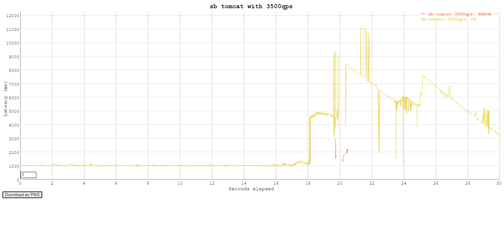
```text
./Attack -cpus=2 -duration=30s -rate=4000

Requests      [total, rate, throughput]         68942, 2273.65, 1383.03
Duration      [total, attack, wait]             49.776s, 30.322s, 19.454s
Latencies     [min, mean, 50, 90, 95, 99, max]  1.001s, 3.4s, 1.842s, 10.995s, 11.829s, 13.811s, 30.016s
Bytes In      [total, mean]                     1376840, 19.97
Bytes Out     [total, mean]                     0, 0.00
Success       [ratio]                           99.85%
Status Codes  [code:count]                      0:100  200:68842
```
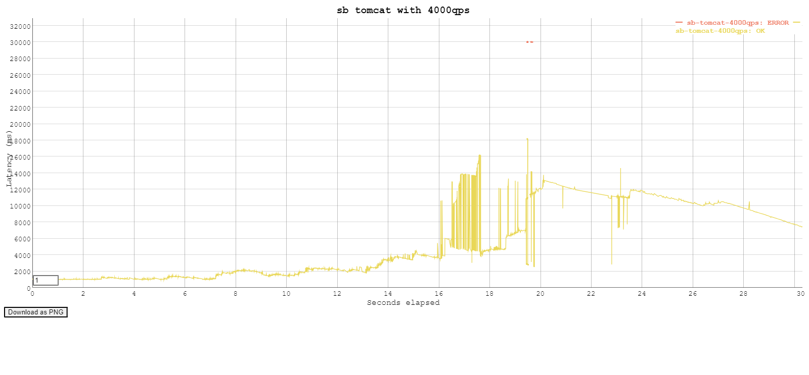
```text
./Attack -cpus=2 -duration=30s -rate=4500

Requests      [total, rate, throughput]         59943, 1724.21, 1301.24
Duration      [total, attack, wait]             45.993s, 34.765s, 11.227s
Latencies     [min, mean, 50, 90, 95, 99, max]  998.588ms, 4.363s, 2.052s, 12.785s, 13.849s, 14.864s, 30.017s
Bytes In      [total, mean]                     1196960, 19.97
Bytes Out     [total, mean]                     0, 0.00
Success       [ratio]                           99.84%
Status Codes  [code:count]                      0:95  200:59848
```
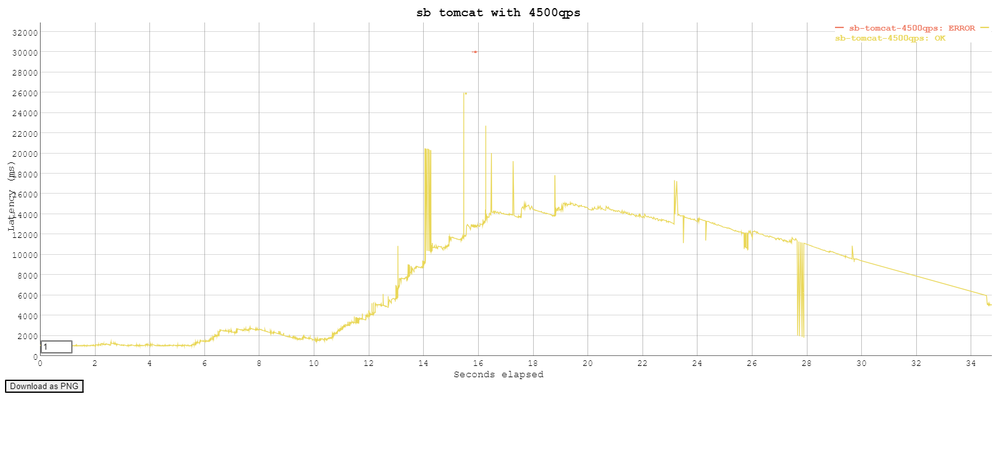

* **spring boot tomcat**
  * server.tomcat.threads.max=1000
  * server.tomcat.threads.min-spare=50
```text
./Attack -cpus=2 -duration=30s -rate=1000

Requests      [total, rate, throughput]         29988, 999.89, 959.49
Duration      [total, attack, wait]             31.254s, 29.991s, 1.263s
Latencies     [min, mean, 50, 90, 95, 99, max]  1.001s, 1.143s, 1.144s, 1.245s, 1.261s, 1.282s, 1.319s
Bytes In      [total, mean]                     599760, 20.00
Bytes Out     [total, mean]                     0, 0.00
Success       [ratio]                           100.00%
Status Codes  [code:count]                      200:29988  
```
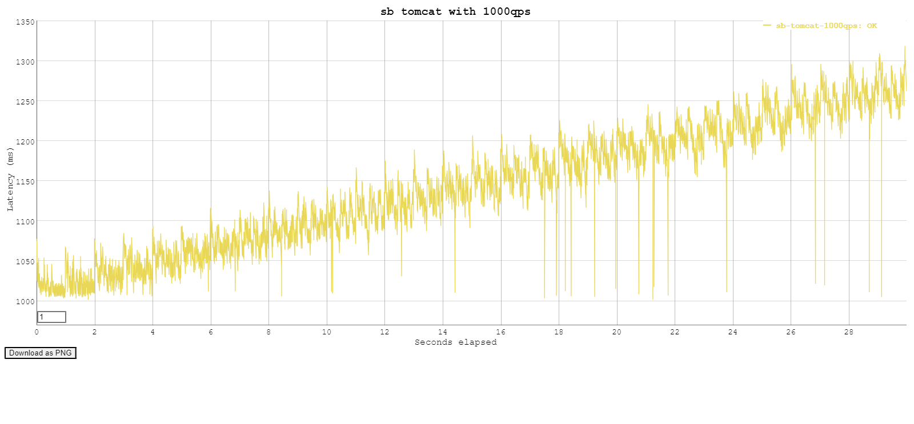
```text
./Attack -cpus=2 -duration=30s -rate=2000

Requests      [total, rate, throughput]         28333, 815.86, 718.21
Duration      [total, attack, wait]             38.249s, 34.728s, 3.521s
Latencies     [min, mean, 50, 90, 95, 99, max]  10.011ms, 9.052s, 9.157s, 16.168s, 16.598s, 17.448s, 31.151s
Bytes In      [total, mean]                     549420, 19.39
Bytes Out     [total, mean]                     0, 0.00
Success       [ratio]                           96.96%
Status Codes  [code:count]                      0:862  200:27471
```
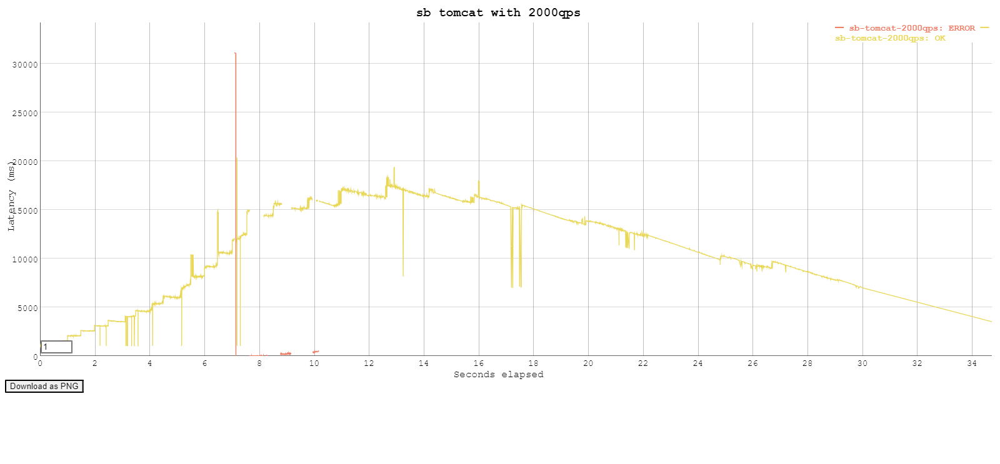
